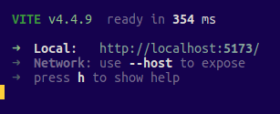
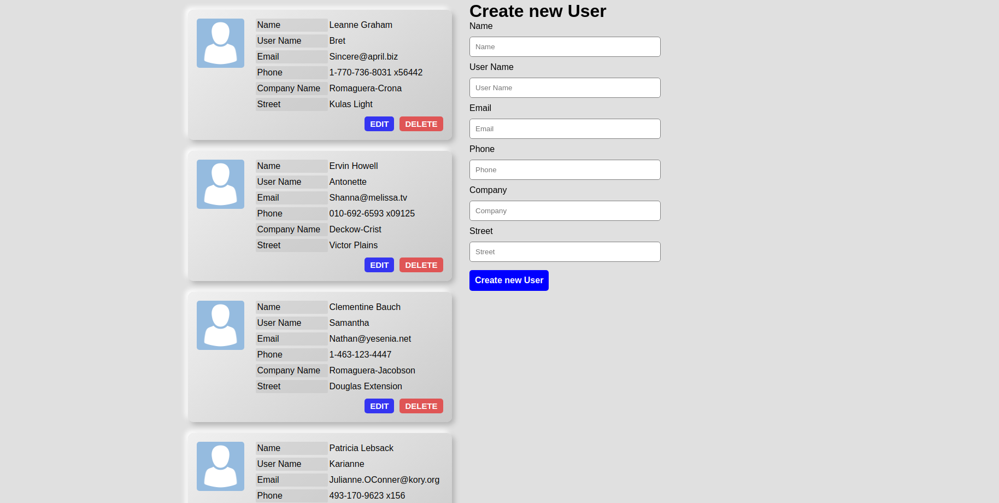
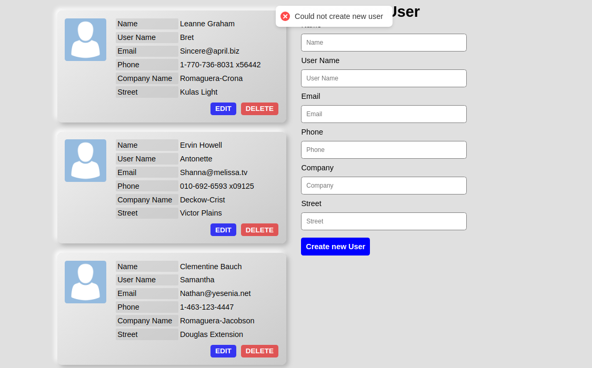
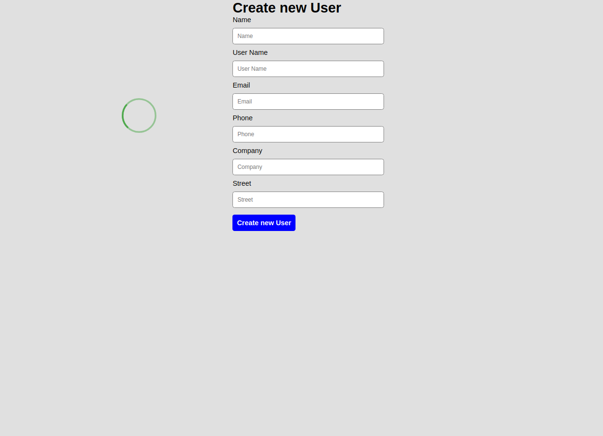
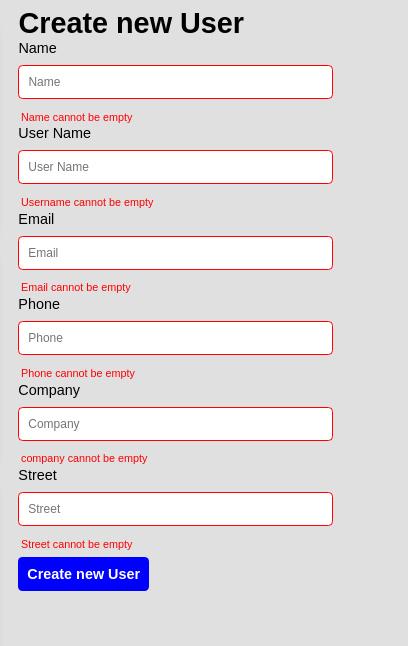

# Shasa, Pesira React take home

The project has been bootrstrapped using vite

To launch the application first make sure Node is installed on your computer. The instructions for launching node can be found at https://nodejs.org/en

After installing node, launch the terminal then copy the command 

```
git clone https://github.com/DevShasa/shasa-pesira-react-take-home.git
```

Navigate to the root of the project and then install dependencies with

```
npm install
```

After all the dependencies have installed launch the application with the command

```
npm run dev
```

After which you should see 



The application is live at   `http://localhost:5173/`

Navigate to this url

## Technologies used
- Vite, for project bootstrap
- Typescript, adding extra type safety
- Redux, for global state management
- Notifications using react hot toast

Homepage




Error Notification on api failiure





Loading indicator




Edit user modal 


Form Validation




## Project folders
- The core files are in the src folder, this is the build target when building the app for production
- Inside the src folder there are several subfolders
   - Components folder holds the individual jsx components that make up the component such as the usercard, and form
   - Hooks folder holds react hooks used by different components
   - Redux folder contains logic for the global redux store as well as the data slices representing different parts of teh application
   - utils folder for non jsx code that is useful and might be used across multiple components
- Each component has its own styling, with the global styles in index.css
- The main entrypoint of the app is Main.tsx which imports the global redux store and then injects App.tsx into the dom

